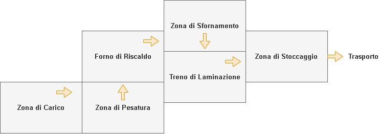
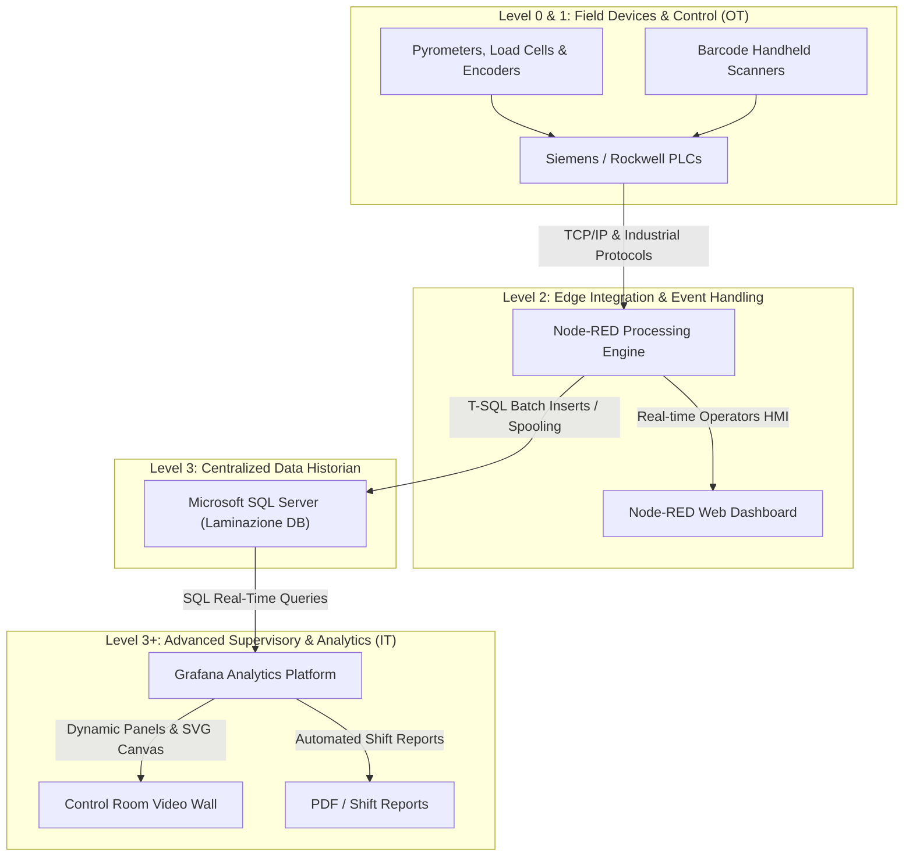
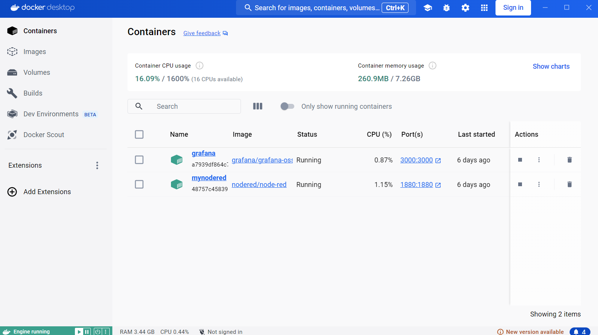
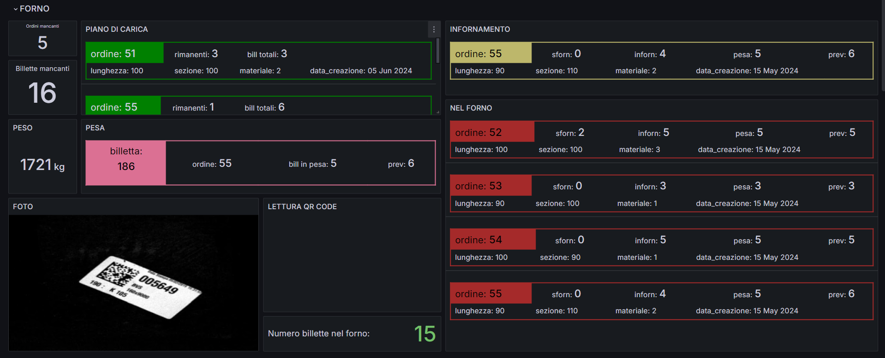
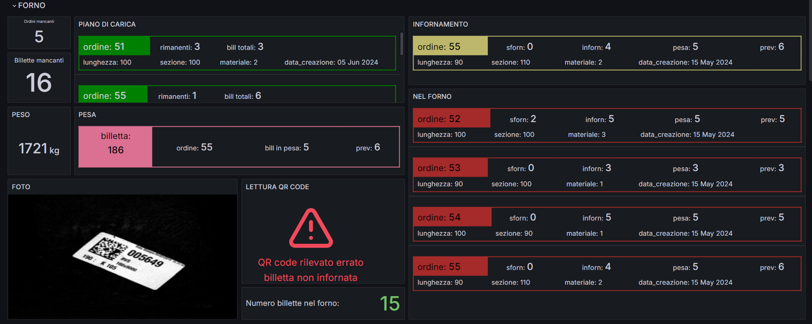
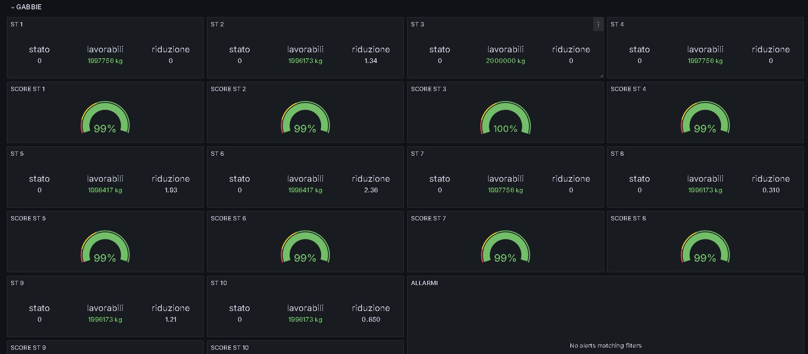
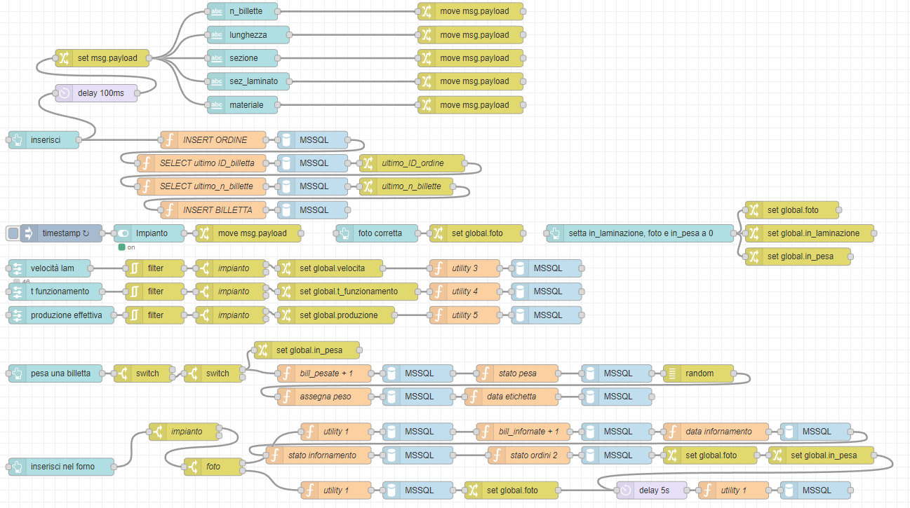

<div align="center">

# 🏭 IIoT & SCADA Predictive Maintenance Architecture for Hot Rolling Steel Mills
### *Data Exploration and Supervision for Smart Manufacturing & Condition-Based Maintenance in Heavy Industry*

[](docs/tesi_Mergoni_Alberto.pdf)
[](https://www.unibs.it/)
[-orange.svg)](https://www.aicnet.it/)
[](https://nodered.org/)
[](https://grafana.com/)
[](https://www.microsoft.com/sql-server)
[](LICENSE)

<br/>

<!-- Hero Layout & Architecture Image -->


</div>

---

## 📌 Executive Summary

Modern metallurgical production environments face strict efficiency requirements, volatile energy costs, and high downtime penalties. In hot rolling steel mills, unscheduled stoppages of rolling stands (*gabbie di laminazione*) or reheat furnaces (*forni di riscaldo*) lead to massive operational losses.

This project presents an **open-source, low-cost Industrial Internet of Things (IIoT) & SCADA supervisory architecture** deployed in collaboration with **Automazioni Industriali Capitanio (AIC)**, a global leader in steel plant automation systems. 

The system bridges **Operational Technology (OT)** and **Information Technology (IT)**:
1. **Real-time Billet Tracking:** End-to-end state machine tracking billets from charging table, weighing barcode stations, through the reheat furnace to rolling stands and final cooling beds.
2. **Roll Wear & Thermal Monitoring:** Continuous telemetry ingestion measuring rolling stand gap adjustments, roll mechanical wear degradation, and furnace temperature profiles.
3. **KPI & OEE Computation:** Real-time computation of **Overall Equipment Effectiveness (OEE)** factoring in plant Availability, Performance rate, and Quality metrics.
4. **Foundation for Predictive Maintenance (PdM):** Structuring and persisting industrial time-series data to feed machine learning models for remaining useful life (RUL) estimation.

---

## 🏗️ System Architecture & OT/IT Convergence

Building on the **ISA-95 Automation Pyramid**, the architecture modernizes traditional Level 2 / Level 3 SCADA functionality using lightweight, containerized open-source technologies:



---

## ⚙️ Process Flow & Billet State Machine

Steel billets undergo rapid mechanical transformation under extreme thermal stresses. To ensure operational traceability, each billet is governed by a finite state machine:

| State Code | Phase | Operational Description | Critical Telemetry |
| :---: | :--- | :--- | :--- |
| **`1`** | **Order Scheduled** | Order planned in production schedule | Target length, cross-section, steel grade |
| **`2`** | **Weighed & Tagged** | Verified at loading bench via barcode scan | Nominal vs. actual raw weight ($\Delta \text{kg}$) |
| **`3`** | **Reheat Furnace** | Walking beam/pusher furnace heating (~1150°C-1200°C) | Zone 1-4 thermocouple temperatures |
| **`4`** | **Ready for Discharge** | Thermal homogenization achieved | Optical pyrometer verification |
| **`5`** | **Rolling Mill Train** | Roughing, intermediate, and finishing stands | Stand motor torque, linear speed, roll wear |
| **`6`** | **Finished Product** | Cooling bed shearing and bundle weighing | Net output weight, final dimensional grade |

---

## 📈 Overall Equipment Effectiveness (OEE) Framework

The platform continuously assesses rolling mill efficiency using international OEE standards:

$$\text{OEE} = \text{Availability} \times \text{Performance} \times \text{Quality}$$

- **Availability ($A$):** Ratio of actual operating time against planned rolling hours:
  $$A = \frac{\text{Operating Hours}}{24.0\text{ h}}$$
- **Performance ($P$):** Ratio of actual throughput versus nominal design speed:
  $$P = \frac{\text{Actual Output (Billets)}}{\text{Target Design Output (1,140 Billets)}}$$
- **Quality ($Q$):** Conforming finished steel ratio:
  $$Q = \frac{\text{Conforming Billets}}{\text{Total Rolled Billets}} \times 100$$

---

## 📸 Supervisory Interfaces & Visual Evidence

<div align="center">

### Operational Overview & Process Canvas
*Interactive Grafana supervisory layout showing furnace zones, roll stands, and live billet queues:*


---

### Reheat Furnace & Thermal Mapping
| Zone Heating Profiles | Thermal Discharging Tracking |
| :---: | :---: |
|  |  |

---

### Rolling Stands & Roll Mechanical Wear Analytics
| Stand Wear Thresholds & Alarms | Rolling Mill Layout & Speed Ratios |
| :---: | :---: |
|  |  |

---

### Node-RED Automation Engine & Real-Time HMI
| Node-RED Logic Flow Execution | Edge Operator Console Interface |
| :---: | :---: |
|  |  |

</div>

---

## 📁 Repository Structure

```text
iiot-predictive-maintenance-steelwork/
│
├── assets/
│   ├── diagrams/              # Architectural diagrams, plant layouts, draw.io sources
│   ├── screenshots/           # Full HD captures of Grafana, Node-RED, and alarms
│   └── barcode/               # Industrial barcode scanner integration assets
│
├── data/
│   ├── backup/                # Database backup (Lam_20240515.bak) with sampled mill telemetry
│   ├── sql/                   # DDL schema definition and analytical queries (schema_laminazione.sql)
│   └── README.md              # Database models, ER diagram, and restore guidelines
│
├── docs/
│   ├── tesi_Mergoni_Alberto.pdf              # Official Thesis Dissertation (B.Sc. UNIBS)
│   ├── Powerpoint_tesi_Mergoni_Alberto.pptx   # Defense Presentation Deck
│   ├── Frontespizio_matr_736132.pdf          # Official Frontispiece
│   ├── esposizione.docx                      # Oral Presentation Script
│   └── drafts/                               # Intermediate drafts and review versions
│
├── src/
│   ├── node_red/
│   │   ├── flows.json         # Complete Node-RED execution flow (JSON)
│   │   └── laminazionenode.json
│   ├── grafana/
│   │   ├── dashboard_laminazione.json        # Exported Grafana SCADA Dashboard
│   │   └── snippets_and_queries.txt          # Dynamic Text HTML panels and SQL filters
│   └── docker/
│       └── docker-compose.yml # Containerized stack: Node-RED + Grafana + MSSQL Server
│
├── execution/
│   └── simulate_telemetry.py  # Python CLI for billet telemetry simulation & OEE metrics
├── directives/
│   └── iiot_monitoring_directive.md # Level 1 Operational SOP
├── requirements.txt           # Python dependencies
├── LICENSE                    # MIT License (Alberto Mergoni)
└── README.md                  # Executive showcase documentation
```

---

## 🚀 Quickstart & Replication

### 1. Launch the Stack with Docker Compose

Reproduce the complete industrial supervisory environment locally:

```bash
cd src/docker
docker compose up -d
```

Services exposed:
- **Node-RED:** `http://localhost:1880`
- **Grafana Supervisor:** `http://localhost:3000` (User: `admin` / Password: `admin`)
- **Microsoft SQL Server:** `localhost:1433` (User: `sa` / Password: `IndustrialStrongPass2024!`)

### 2. Import Node-RED Flows & Grafana Dashboards
- Open Node-RED (`http://localhost:1880`) -> Menu -> Import -> Select [`src/node_red/flows.json`](src/node_red/flows.json).
- Open Grafana (`http://localhost:3000`) -> Dashboards -> New -> Import -> Select [`src/grafana/dashboard_laminazione.json`](src/grafana/dashboard_laminazione.json).

### 3. Run the Telemetry & OEE Simulator

```bash
# Install lightweight test dependencies
pip install -r requirements.txt

# Run mill simulation with 15 billets and compute live OEE
python execution/simulate_telemetry.py --billets 15 --avail_hours 23.1 --actual_prod 1102
```

---

## 🎓 Academic Attribution & Thesis Details

```bibtex
@thesis{mergoni2024iiot,
  author       = {Alberto Mergoni},
  title        = {Esplorazione e Gestione dei Dati Finalizzate alla Manutenzione Predittiva nell'Industria Siderurgica},
  school       = {Universit{\`a} degli Studi di Brescia (UNIBS)},
  department   = {Dipartimento di Ingegneria dell'Informazione},
  type         = {B.Sc. Thesis in Digital Business Technologies Engineering},
  supervisor   = {Prof. Devis Bianchini},
  year         = {2024},
  month        = {July},
  day          = {10},
  note         = {In collaboration with Automazioni Industriali Capitanio (AIC)}
}
```

---

## 📄 License

This repository is distributed under the **MIT License**. See the [LICENSE](LICENSE) file for more information.
