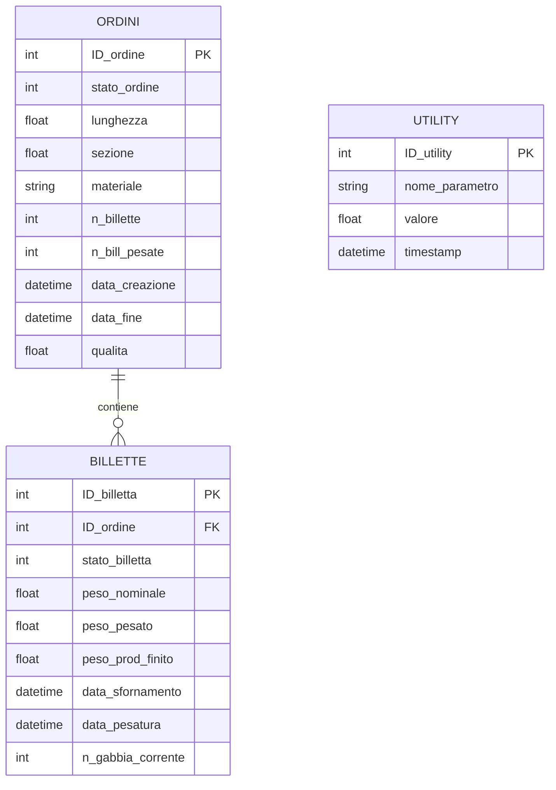

# 🗄️ Database Architecture & Industrial Data Models

Questo modulo documenta l'architettura dei dati, il modello relazionale e le procedure di ripristino per il sistema di supervisione e monitoraggio del laminatoio.

---

## 🏗️ Modello Entità-Relazione (ER)

Il database Microsoft SQL Server (`Laminazione`) modella il ciclo di vita completo del processo siderurgico, dal caricamento degli ordini fino alla laminazione finita e al monitoraggio delle utility:



---

## 📊 Macchina a Stati della Billetta (`stato_billetta`)

Il tracciamento real-time segue una macchina a stati finiti (FSM) rigorosa:

| Stato | Codice | Descrizione Operativa |
| :---: | :---: | :--- |
| **Pianificata** | `1` | Billetta associata all'ordine di produzione in attesa di pesatura |
| **Pesata al Banco** | `2` | Billetta scansionata via Barcode e verificata con bilancia di carico |
| **In Forno di Riscaldo** | `3` | Billetta in transito termico (temperatura target: ~1150°C - 1200°C) |
| **Pronta allo Sfornamento**| `4` | Temperatura omogenea raggiunta, autorizzazione all'espulsione |
| **In Treno di Laminazione**| `5` | Transito attraverso le gabbie sbozzatrici, intermedie e finitrici |
| **Prodotto Finito** | `6` | Billetta laminata, transitata sulla placca di raffreddamento e pesata |
| **Scarto / Evacuata** | `9` | Billetta con difetti dimensionali o blocco termico |

---

## 💾 Ripristino del Backup SQL (`Lam_20240515.bak`)

Il file `Lam_20240515.bak` situato in `data/backup/` contiene un dump completo di Microsoft SQL Server con i dati reali/campionati di processo durante le sessioni sperimentali.

### Procedura di Restore tramite T-SQL:

```sql
RESTORE DATABASE [Laminazione]
FROM DISK = N'/var/opt/mssql/backup/Lam_20240515.bak'
WITH FILE = 1,
MOVE N'Laminazione' TO N'/var/opt/mssql/data/Laminazione.mdf',
MOVE N'Laminazione_log' TO N'/var/opt/mssql/data/Laminazione_log.ldf',
NOUNLOAD, STATS = 5;
GO
```

---

## 📈 Query Cardine per Dashboard e KPI OEE

Le query T-SQL utilizzate nei pannelli di monitoraggio sono riportate in [`data/sql/schema_laminazione.sql`](sql/schema_laminazione.sql) e in [`src/grafana/snippets_and_queries.txt`](../src/grafana/snippets_and_queries.txt).
